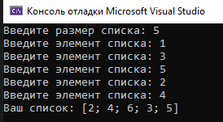
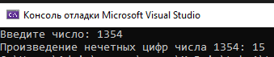
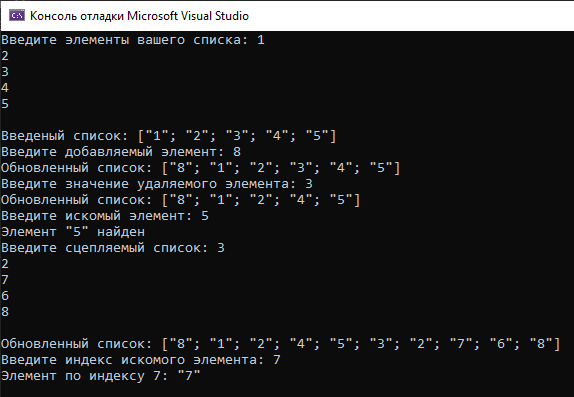

# Красных Александр ИТС-2 Лабораторная №1

# Задание 1

### Текст задачи

Сформировать список из чисел, на 1 больших, чем вводимые значения.

### Алгоритм решения

1. Запрос ввода размера и элементов списка от пользователя
2. Получить исходный список
3. Вызвать встроенную функцию F# для прибавления 1 к значениям списка
4. Вывести новый список на экран

### Тестирование

# Задание 2

### Текст задачи

Найти произведение нечётных цифр натурального числа.

### Алгоритм решения

1. Запрос исходного числа от пользователя
2. Вызов функции умножения нечетных чисел
3. Вывод результата работы функции

### Тестирование

# Задание 3

### Текст задачи

Создайте собственные функции для выполнения основных операций над списками (добавление/
удаление/поиск элемента, сцепка двух списков, получение элемента по номеру).

### Алгоритм решения

1. Запрос вводных данных
2. Обращение к соотвествующей функции
3. Проверка каждой написанной функции

### Тестирование

